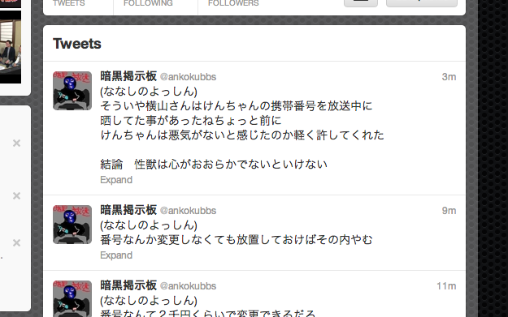

nicobbs to twitter
==
scraping niconama bbs, and update status to twitter.

sample
--


requirements
--
1. python 2.7.x-
2. mongodb

setup
--
````
$ git submodule update --init
$ virtualenv --distribute venv
$ source ./venv/bin/activate
$ pip install http://sourceforge.net/projects/pychecker/files/pychecker/0.8.19/pychecker-0.8.19.tar.gz/download
$ sudo apt-get install libxml2-dev libxslt-dev
$ pip install -r requirements.txt
````

configure mongo
--
database indexes are needed for proper query execution plan.

(optional) check current scheme.
````
$ mongo
show dbs
use dev-nicobbs-v2
show collections

// we store data into the collections that are named 'response', 'live' and 'news'
db.response.find()
db.response.getIndexes()
db.live.find()
db.live.getIndexes()
db.news.find()
db.news.getIndexes()
````

(required) create indexes.
````
db.response.ensureIndex({community:1, number:1})
db.response.ensureIndex({community:1, status:1})

db.live.ensureIndex({community:1, link:1})
db.live.ensureIndex({community:1, status:1})

db.news.ensureIndex({community:1, date:1})
db.news.ensureIndex({community:1, status:1})
````

kick
--
start.
````
$ ./nicobbs.sh start
````
stop.
````
$ ./nicobss.sh stop
````

monitoring example using crontab
--
	# monitoring nicoalert
	* * * * * /path/to/nicobbs/nicobbs.sh monitor >> /path/to/nicobbs/log/monitor.log 2>&1

snippets for me
--
copy collection to another database.
````
use dev-nicobbs-v2
db.news.find().forEach(function(d){ db.getSiblingDB('nicobbs-v2')['news'].insert(d); });
````
- http://stackoverflow.com/a/11554924

license
--
copyright &copy; 2012- honishi, hiroyuki onishi.

distributed under the [MIT license][mit].
[mit]: http://www.opensource.org/licenses/mit-license.php
